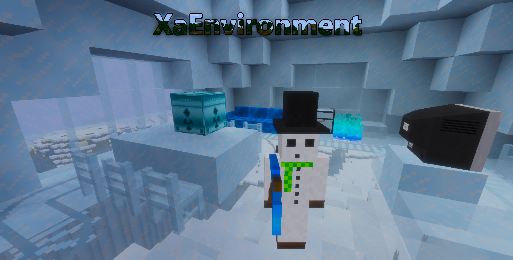

# XaEnvironment V8.9

Licenses: code: LGPL-2.1, media: CC BY-SA-4.0

## Compatible for minetest 5.3, tested in 3.4-dev

---

## api info:

[default](mods/default/default%20api.txt)  
[armor](mods/armor/api%20info.txt)  
[exaachievements ](mods/exaachievements/info.txt)  
[nitroglycerin](mods/nitroglycerin/api.lua)  
[player_style](mods/player_style/info.txt)  
[examobs](mods/examobs/api%20info.txt)  

